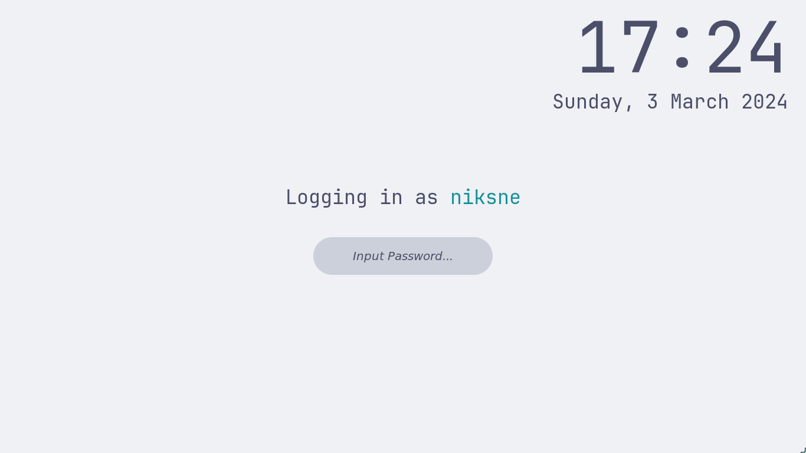
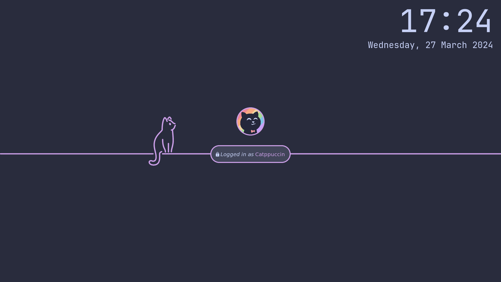
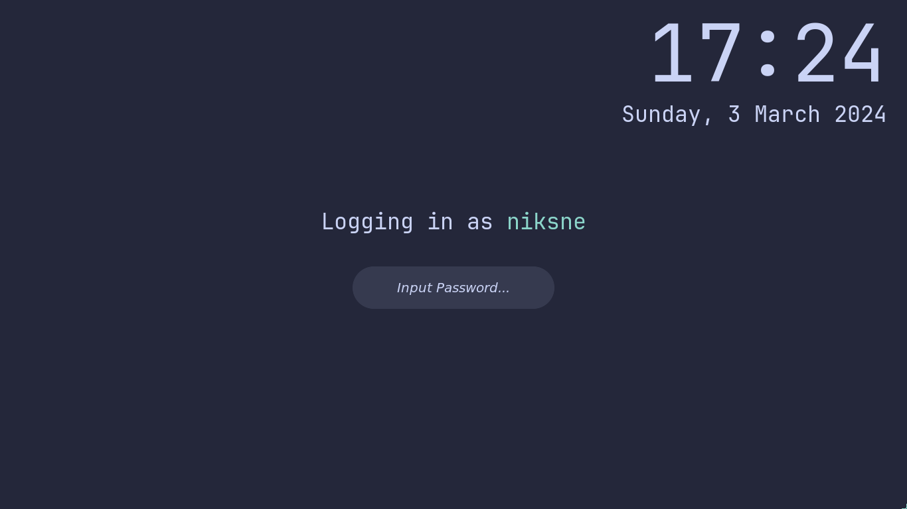
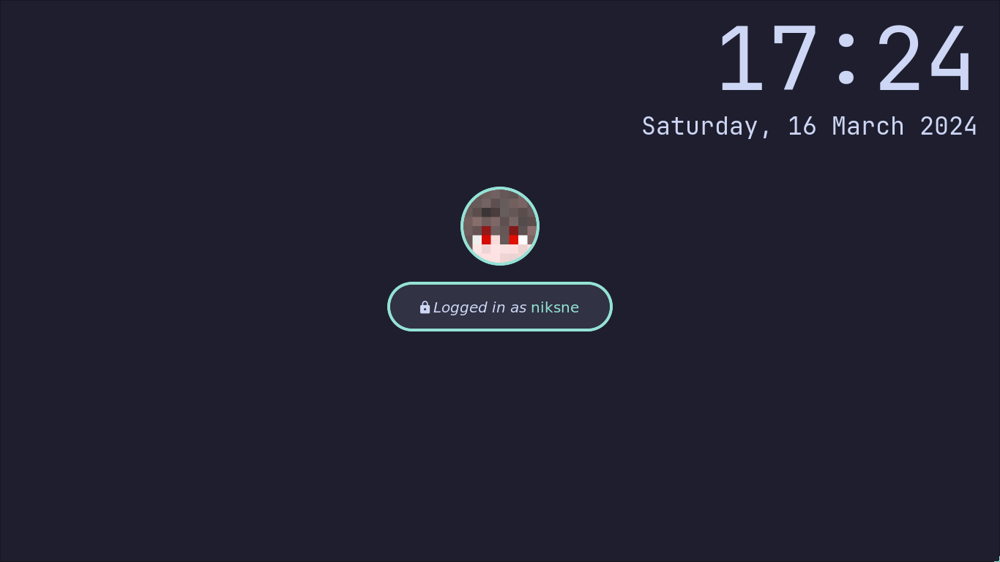

<h3 align="center">
	 
	
	Catppuccin for <a href="https://github.com/hyprwm/hyprlock">Hyprlock</a>
	
</h3>

	
	
	

	

## Previews

  
🌻 Latte

  

  
🪴 Frappé

  

  
🌺 Macchiato

  

  
🌿 Mocha

  

## Usage

1. Download the file with theme (`hyprlock.conf`)
2. Download the file with your desired flavour (e.g. `mocha.conf`) from [catppuccin/hyprland](https://github.com/catppuccin/hyprland)
3. Copy them into your hyprland config directory (e.g. `~/.config/hypr/`)
4. Change `source` to `/path/to/flavour.conf` (e.g. `~/.config/hypr/mocha.conf`)
5. (optional) Change your accent color and font

## 🙋 FAQ

-	Q: **_"How to set user image/background?"_**\
	A: The [hyprlock.conf](./hyprlock.conf) file is just an example config, so you may and should modify it to fit your needs.

- Q: **_"Where can I get backgrounds from the previews?"_**\
  A: You can find gray SVG and PNG [here](https://github.com/catppuccin/catppuccin/tree/main/assets/footers) or extract colored PNG from [Catppuccin for Vivaldi](https://github.com/catppuccin/vivaldi)

## 💝 Thanks to

- [NikSne](https://github.com/NikSneMC)

&nbsp;

	

	Copyright &copy; 2021-present <a href="https://github.com/catppuccin" target="_blank">Catppuccin Org</a>

	

